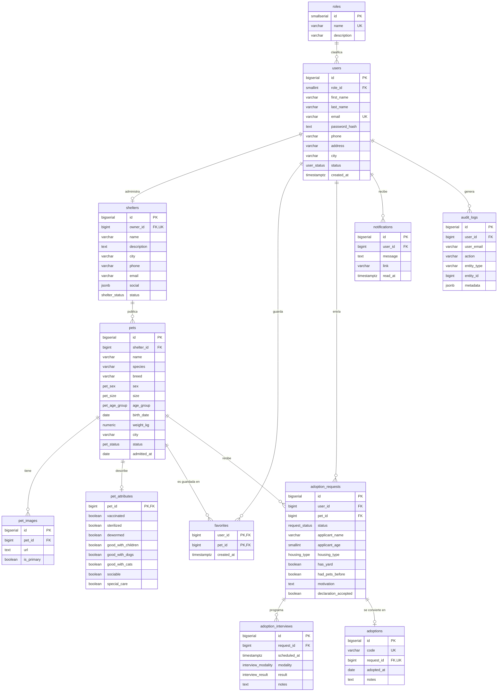

# Modelo de datos

Trece tablas relacionadas que cubren usuarios, refugios, mascotas, el proceso de
adopción, la trazabilidad del sistema y los enlaces de un solo uso.

## Diagrama entidad-relación



## Tipos enumerados

| Tipo | Valores |
| --- | --- |
| `user_status` | `ACTIVO`, `SUSPENDIDO` |
| `shelter_status` | `PENDIENTE`, `VERIFICADO`, `SUSPENDIDO` |
| `pet_status` | `DISPONIBLE`, `EN_PROCESO`, `ADOPTADA`, `NO_DISPONIBLE` |
| `pet_sex` | `Macho`, `Hembra` |
| `pet_size` | `Pequeño`, `Mediano`, `Grande` |
| `pet_age_group` | `Cachorro`, `Joven`, `Adulto`, `Senior` |
| `request_status` | `PENDIENTE`, `EN_REVISION`, `ENTREVISTA`, `APROBADA`, `RECHAZADA`, `CANCELADA`, `ADOPCION_COMPLETADA` |
| `interview_modality` | `Presencial`, `Videollamada`, `Telefónica` |
| `interview_result` | `Pendiente`, `Aprobada`, `No aprobada` |
| `housing_type` | `Casa`, `Departamento`, `Otro` |

`roles` es una tabla y no un tipo enumerado porque la especificación la exige como
entidad (§53) y porque permite describir cada rol y relacionarlo con `users` (§54).

## Decisiones de diseño

**Datos del solicitante duplicados en `adoption_requests`.** Nombre, edad,
teléfono, correo y dirección se guardan en la solicitud aunque el usuario ya los
tenga en su perfil. Una solicitud es un documento histórico: si el adoptante se
muda después, la solicitud debe seguir reflejando lo que declaró en su momento.

**Restricción de solicitudes duplicadas.** Un índice único parcial impide que un
usuario tenga dos solicitudes vivas para la misma mascota (§35.5):

```sql
CREATE UNIQUE INDEX adoption_requests_one_active_per_user_pet
  ON adoption_requests (user_id, pet_id)
  WHERE status IN ('PENDIENTE', 'EN_REVISION', 'ENTREVISTA', 'APROBADA');
```

Al ser parcial, permite volver a solicitar una mascota tras una cancelación o un
rechazo, que es el comportamiento deseado.

**Una sola fotografía principal.** Otro índice parcial garantiza la unicidad:

```sql
CREATE UNIQUE INDEX pet_images_one_primary ON pet_images (pet_id) WHERE is_primary;
```

**`age_group` derivado.** Cuando el refugio conoce `birth_date`, la aplicación
calcula el grupo etario y la etiqueta legible; si no, respeta lo declarado a mano.
Se guarda el valor calculado en lugar de derivarlo en cada consulta para poder
indexarlo y filtrar por él sin coste.

**`pets.search_text`: la búsqueda en una sola columna.** El §14 pide buscar por
nombre, raza, ciudad y refugio. La primera versión lo hacía con un OR sobre el
JOIN:

```sql
WHERE p.name ILIKE ? OR p.breed ILIKE ? OR p.city ILIKE ? OR s.name ILIKE ?
```

Esa consulta **no puede usar ningún índice**: al abarcar el OR dos tablas, el
planificador tiene que recorrer `pets` entera y evaluar la condición después de
unir. Medido sobre 200.000 mascotas daba un *Parallel Seq Scan* de **67 ms**.

La solución es una columna desnormalizada en `pets` que concentra todo el texto
buscable —incluido el nombre del refugio—, en minúsculas y sin acentos, mantenida
por dos triggers: uno en `pets` y otro en `shelters` para cuando un refugio cambia
de nombre. Con un índice GIN de trigramas sobre ella, la misma búsqueda pasa a un
*Bitmap Index Scan* de **3,6 ms**, y deja de crecer con el tamaño de la tabla.

Usar `unaccent` no es cosmético: iguala el comportamiento con el del modo memoria,
que ya comparaba sin acentos. Sin él, buscar "peru" no encontraba "Huellitas Perú"
en PostgreSQL pero sí en memoria — justo la clase de divergencia que la
arquitectura pretende evitar.

**Tokens guardados como hash.** `auth_tokens` almacena el SHA-256 del enlace de
verificación o de recuperación, nunca el valor en claro. Quien consiga leer la base
de datos no puede suplantar a nadie, igual que ocurre con las contraseñas. Cada
token es de un solo uso —tiene `used_at`— y caduca: 24 horas para verificar el
correo, una hora para restablecer la contraseña.

**Consentimiento versionado.** `users` guarda cuándo se aceptaron los términos y la
política, y con qué versión (`legal_version`). Sin la versión no se podría saber a
qué texto se comprometió cada persona: si el documento cambia de forma sustancial,
el consentimiento anterior deja de cubrirlo y hay que volver a pedirlo.

**Fechas automáticas en UTC.** `admitted_at` y `adopted_at` usaban
`CURRENT_DATE`, que devuelve la fecha según el huso de la sesión de PostgreSQL
—es decir, según dónde esté alojada la base—. El modo memoria calculaba
siempre la fecha UTC, así que con la base en UTC+14 una misma adopción quedaba
registrada el día 27 en un motor y el 26 en el otro. Ahora ambos se anclan a
UTC: la referencia no cambia al mover el servidor, y la interfaz sigue
mostrando las fechas en el huso de quien mira.

**Escrituras de estado condicionadas.** `transition()` sólo aplica el cambio si
la solicitud sigue en el estado que leyó quien lo decidió
(`WHERE id = $1 AND status = $4`). Sin esa condición, dos peticiones
simultáneas —aprobar y rechazar— leían el mismo estado, ambas se daban por
válidas y el adoptante recibía las dos notificaciones contradictorias.

**Auditoría con correo desnormalizado.** `audit_logs` guarda `user_email` además de
`user_id`, y la clave foránea usa `ON DELETE SET NULL`: si una cuenta se elimina, la
evidencia de qué hizo sigue siendo legible.

**Código de adopción por trigger.** `adoptions.code` se genera en la base de datos
(`ADP-00042`), de modo que sea único aunque se inserte desde fuera de la API.

**`updated_at` automático.** Un trigger `touch_updated_at` mantiene la columna al
día en `users`, `shelters`, `pets`, `adoption_requests` y `adoption_interviews`, sin
depender de que la aplicación se acuerde de actualizarla.

## Índices

Además de las claves primarias y únicas, se indexa lo que realmente se filtra:

- `pets`: `status`, `lower(species)`, `lower(city)`, `shelter_id`, `created_at DESC`
- `pets.search_text`: GIN de trigramas para la búsqueda de texto libre
- `shelters`: `status`, `lower(city)`
- `users`: `role_id`, `status`
- `favorites`: `(user_id, created_at DESC)`, `pet_id`
- `adoption_requests`: `(user_id, created_at DESC)`, `pet_id`, `status`
- `notifications`: índice parcial sobre las no leídas, que alimenta el contador
- `audit_logs`: `created_at DESC`

## Migraciones

| Archivo | Contenido |
| --- | --- |
| `001_initial_schema.sql` | Tipos base, `roles`, `users`, `shelters` |
| `002_pets.sql` | `pets`, `pet_images`, `pet_attributes` |
| `003_adoptions.sql` | `favorites`, `adoption_requests`, `adoption_interviews`, `adoptions` |
| `004_activity.sql` | `notifications`, `audit_logs` |
| `005_indexes_and_triggers.sql` | Índices y triggers de mantenimiento |
| `006_search_indexes.sql` | Columna `search_text`, triggers e índices GIN de búsqueda |
| `007_accounts_legal_and_files.sql` | Verificación de correo, aceptación legal, `auth_tokens` y metadatos de archivos |
| `008_dates_in_utc.sql` | Fechas automáticas ancladas a UTC, no al huso del servidor |

El ejecutor (`backend/src/scripts/migrate.js`) registra cada archivo aplicado en
`schema_migrations` y envuelve cada uno en su propia transacción. Volver a
ejecutar `npm run db:migrate` sobre una base al día no hace nada.
